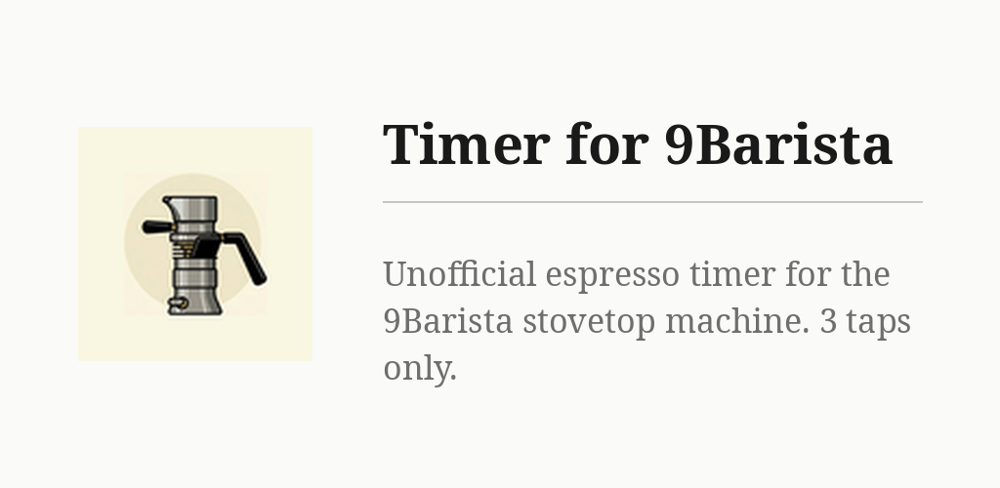
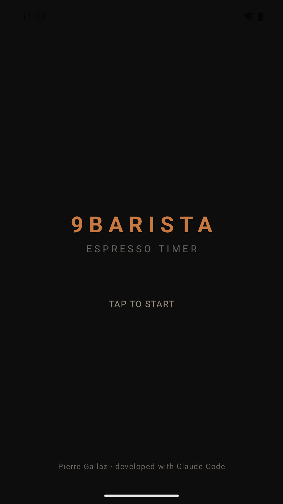

# Timer for 9Barista

An espresso timer for the 9Barista stovetop machine, three taps per brew: when it
goes on the stove, when coffee appears, when done. Heating time, then extraction
with the 25–30 s zone marked, then grind advice. No network, no ads, no account.

## Key points

- First tap starts the heating count; it warns at 8 minutes.
- Second tap starts the extraction timer: a progress ring, green between 25 and 30 s.
- Third tap shows both times and the verdict: grind finer under 25 s, coarser over
  30 s, otherwise perfect.
- Vibrates at 25 s, 30 s and 8 min. The screen stays on while brewing.
- Nothing is stored, no brew history. Only permission: vibration.

## Install

- **F-Droid** (recommended, updates arrive by themselves): add the repository from [gallaz.ch/eink](https://gallaz.ch/eink/#fdroid), or the address `https://funkypitt.github.io/fdroid-repo/repo` in F-Droid.
- **Obtainium**: tap the badge on the phone, or add `https://github.com/funkypitt/9barista-timer` in Obtainium.
- **APK**: attached to the [latest release](../../releases/latest). No automatic updates.

All three deliver the same file, with the same signature.

- **F-Droid:** add the repo `https://funkypitt.github.io/fdroid-repo/repo`
  and search for "Timer for 9Barista"
- **APK:** grab the latest from the
  [repo listing](https://funkypitt.github.io/fdroid-repo/repo/)

Requires Android 8.0+.

## Build

`ANDROID_HOME=<sdk> ./gradlew assembleRelease`

## Disclaimer

This is an unofficial, fan-made app. It is not affiliated with or
endorsed by 9Barista Ltd. "9Barista" is a trademark of its owner and
is used here only to identify the machine the timer is designed for.

## License

MIT

## Crédits / Credits

© 2026 Pierre Gallaz. Développé avec [Claude Code](https://claude.com/claude-code) (Anthropic).
Licence MIT, voir `LICENSE`.

© 2026 Pierre Gallaz. Developed with [Claude Code](https://claude.com/claude-code) (Anthropic).
MIT licence, see `LICENSE`.

## Captures d'écran

